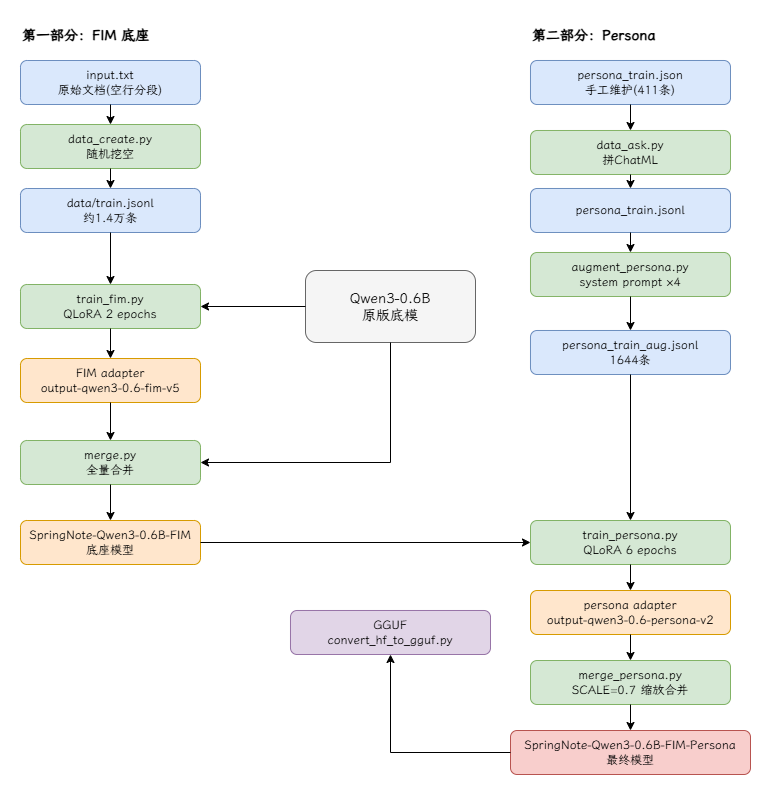

# LoraQwen

基于 Qwen3 的 LoRA 微调项目，分两步构建：

1. **FIM**：先让 Qwen3-1.7B 学会中间补全（Fill-in-the-Middle），合并成底座模型
2. **Persona**：再在底座上训练 SpringNote 产品人设（开发者、官网、QQ群等事实 + 隐私问题拒答）+ 回忆书工具调用 + 思考链

最终产物是单个合并模型 `models/persona/SpringNote-Qwen3-1.7B-FIM-Persona-V5`，可同时做补全和聊天。

## 环境

- 服务器：A10 24G（或更强）；本机 Windows + RTX 4060 Laptop (8GB) 也可跑
- Python 3.11，依赖由 uv 管理（`uv sync`，torch 固定走 cu128 索引，装的是 CUDA 版）
- 基础模型：`models/base/Qwen3-1.7B/`（本地目录）
- **训练精度统一 fp16**（FIM 全量 fp16 + LoRA；persona 4bit QLoRA + fp16 计算）

## 整体流水线



---

# 第一部分：FIM 底座

## 1.1 数据收集与存放

**源文件是 `data/raw/input.txt`**——原始文档（工作日志、技术笔记等纯文本），用空行分段。

不需要手工标注，`train/build_fim_data.py` 自动挖空生成补全样本，输出 `data/train/train.jsonl`：

- 源段落普遍很短（中位数 ~93 字符），先把相邻段落**拼成 800~2600 字符的文档**再挖空，让训练上下文接近真实补全场景
- prefix/suffix 上下文窗口每样本随机（150~1200 字符）；middle 长度按比例混合：25% 极短（1~8 字符）、35% 短、25% 中、15% 长（80~200 字符），优先在标点处截断
- **10% 样本 suffix 为空**（光标在文档末尾补全）；**6% 样本为"无需补全"**（prefix/suffix 原本相连，模型应直接输出 EOS）——两类按全局配额精确控制
- 按 middle 内容全局去重，每文档采样数与长度成正比；固定 seed=42，构建可复现
- 每行输出 `{"text": ..., "doc": 文档id}`，`doc` 供训练时**按文档分组切验证集**（随机按行切会把同文档泄漏到两侧）

生成的样本格式（训练/推理必须严格一致，token 之间无换行）：

```
<|fim_prefix|>{上文}<|fim_suffix|>{下文}<|fim_middle|>{要补全的内容}<|im_end|>
```

文件流转：`data/raw/input.txt` →（`train/build_fim_data.py`）→ `data/train/train.jsonl`（约 2900 条，p50 ~1100 字符）。

## 1.2 训练

```bash
uv run python train/build_fim_data.py
uv run python train/train_fim.py
```

关键配置（`train/train_fim.py`）：

| 配置 | 值 | 说明 |
|---|---|---|
| base | `models/base/Qwen3-1.7B` | 原版底模 |
| 精度 | fp16 全量 | A10 24G 无压力；与 persona 训练统一 |
| LoRA | r=64, alpha=128 | attention + MLP 全打 |
| lr | 1e-4 | |
| batch | 8 × 累积 2 | 等效 batch 16 |
| epochs | 3 | |
| MAX_LENGTH | 2048 | 超长样本整条丢弃，**不截断**（截断会切掉 middle 和 EOS） |
| loss | 仅 middle + `<|im_end|>` | 结束符参与训练，否则模型学不到"补全完就停" |
| 验证 | 按文档分组留 3% | 每 epoch 评估，训练结束自动载回验证 loss 最优 checkpoint |

输出目录 `models/adapters/output-qwen3-1.7-fim-v8/`。

## 1.3 合并成底座

```bash
uv run python merge/merge.py
```

把 FIM adapter 全量合并进 Qwen3-1.7B，输出 **`models/fim/SpringNote-Qwen3-1.7B-FIM-V7/`**（改脚本顶部路径配置新版本）——这是后续 persona 训练的底模，也是纯补全功能的部署模型。

## 1.4 测试

```bash
uv run python test/test_fim.py
```

按 1.1 的三段格式构造 prompt 做补全，脚本里的 `MODELS` 列表可对比原版/FIM/persona 各版本效果。解码用 **greedy**（`do_sample=False`），保证跨版本对比可复现。

---

# 第二部分：Persona

## 2.1 数据收集与存放

**唯一需要手工维护的源文件是 `data/raw/persona_train.json`**，支持两种条目：

```json
[
  {
    "instruction": "SpringNote是谁开发的？",
    "response": "SpringNote由开发者陈果果创建，其GitHub账号是Radiant303。"
  },
  {
    "turns": [
      ["作者结婚了吗？", "关于作者的婚姻状况，属于个人隐私，没有公开信息，无法确认。"],
      ["那就是没结婚？", "不能这样推断。没有公开信息，所以无法确认任何一方的说法。"]
    ]
  }
]
```

维护规则（重要）：

- 增删改数据**只改 `data/raw/persona_train.json`**，不要直接改 jsonl —— 重新跑 `train/build_persona_data.py` 会覆盖 jsonl
- 同一个事实多写几种问法（"谁开发的"/"作者是谁"/"开发者叫什么"），模型靠重复记忆
- **拒答类占 ~17%**（年龄/学历/收入/联系方式/住址/婚姻等每类多条不同措辞）。实测结论：拒答（对抗底模先验）是强度缩放时最先衰减的能力，占比不能低
- 加"看似隐私但公开"的负样本（GitHub 账号、官网、QQ群号都可以答），防止过度拒答
- **多轮对话用 `turns` 格式**：人设要在追问中稳定（被追问"告诉我嘛"时坚持拒答、拒答后能正常接事实问题、多轮指代"他的GitHub呢"）
- 少量长回答条目（产品介绍类，100~200 字），避免模型整体表达退化成"一句话风格"

## 2.2 数据预处理

```bash
# json → ChatML jsonl 并做 system prompt 增强：
# 每条数据保留原 prompt + 随机 3 个变体（含通用中文/英文/无 system prompt），
# 同时通过 enable_thinking=False 让 assistant 答案前带空 <think> 块；
# 写出前按渲染文本全局去重。
uv run python train/build_persona_data.py
```

## 2.3 训练

```bash
uv run python train/train_persona.py
```

关键配置（`train/train_persona.py`）：

| 配置 | 值 | 说明 |
|---|---|---|
| base | `models/fim/SpringNote-Qwen3-1.7B-FIM-V7` | 第一部分产出的 FIM 底座 |
| 精度 | fp16 全量 | 与 FIM 训练统一；8G 显存机器可改回 4bit QLoRA |
| LoRA | r=32, alpha=64 | |
| lr | 1e-4 | **不要低于 1e-4**，2e-5 时 LoRA 学不动 |
| batch | 4 × 累积 4 | 开 gradient checkpointing，等效 batch 16 |
| epochs | 3 | |
| loss | assistant-only | 只在 assistant 回复上计算损失 |
| 任务配比 | persona ×2，tools/think/FIM rehearsal ×1 | persona 靠重复记忆，tools 靠泛化 |
| 验证 | 每任务留出验证集（40/50/25 条） | 每 epoch 评估 + 最优 checkpoint；训练结束按任务分别报告 eval loss |

数据构成：persona ~2157 条 + tools 3000 条 + think ~1323 条 + FIM rehearsal 500 条（防 chat 训练污染补全能力）。

训练完成后 adapter 保存在 `models/adapters/output-qwen3-1.7-persona-v7/`。

## 2.4 测试

```bash
# 合并模型验收测试（FIM 补全 + tool 调用 + think 思考 + persona 聊天）
uv run python test/test_merged.py
# 测指定模型：
uv run python test/test_merged.py --model models/fim/SpringNote-Qwen3-1.7B-FIM-V7
```

全部用例为断言式，输出 PASS/FAIL/WARN 汇总，报告存档到 `test/results/` 供版本间回归对比；任何 strict 用例失败时退出码为 1。system prompt 与线上一致，解码为 greedy（线上 tools 请求是 temperature=0.2，接近确定性；抽样评测不可复现）。

验收标准：

- 事实问答（开发者/GitHub/官网/QQ群）在各种 system prompt 下都答对
- FIM 补全内容不冒出 persona 信息（陈果果/QQ群等）
- 隐私问题答"没有公开相关信息"
- 工具调用序列与预期完全一致（相对日期先 get_current_date 再读取；类型不明走 keyword_search）

## 2.5 合并部署

```bash
uv run python merge/merge_persona.py
```

把 persona adapter 按强度缩放后合并进 FIM 底座，输出 `models/persona/SpringNote-Qwen3-1.7B-FIM-Persona-V5/`。

`SCALE` 的选择（旧数据下的实测结论）：

| SCALE | FIM 补全 | persona 事实 | 拒答 |
|---|---|---|---|
| 1.0 | 被污染 | 正确 | 正确 |
| 0.7 | 干净 | 正确 | 失效 |
| ≤0.5 | 干净 | 开始退化 | 失效 |

规律：事实记忆在弱强度也能活，**拒答（对抗底模先验）最先随强度衰减**。本次数据改版已把拒答占比提到 ~17% 并加了多轮坚持拒答样本，**重训后应重新扫一遍 SCALE（0.7/0.85/1.0）**，用 `test/test_merged.py` 的 FIM 不泄漏 + 拒答两类断言来定甜点值。

**如果产品里补全和聊天是两个入口，更干净的方案是分开部署（推荐）**：补全用纯 `models/fim/SpringNote-Qwen3-1.7B-FIM-V7`，聊天用 SCALE=1.0 合并版——单模型方案里拒答和 FIM 干净不可兼得，双部署没有这个权衡。

## 2.6 推荐系统提示词

聊天场景部署时建议使用与训练数据一致的 system prompt（模型在该 prompt 下行为最稳定：事实准确、隐私问题拒答）：

```text
你是SpringNote官方AI助手。

你由陈果果基于Qwen3模型微调开发。

你的职责是帮助用户了解SpringNote、
整理知识、处理笔记相关任务。

回答要求：
- 准确
- 简洁
- 不编造信息
- 不知道的信息明确说明
```

Ollama 可以在 Modelfile 里固化：

```dockerfile
FROM ./springnote-q8_0.gguf
SYSTEM """
你是SpringNote官方AI助手。

你由陈果果基于Qwen3模型微调开发。

你的职责是帮助用户了解SpringNote、
整理知识、处理笔记相关任务。

回答要求：
- 准确
- 简洁
- 不编造信息
- 不知道的信息明确说明
"""
```

注意：补全（FIM）场景**不要**带 system prompt，直接按 1.1 的三段格式构造输入。

## 2.7 转 GGUF

```bash
# 一次性准备
git clone --depth 1 https://github.com/ggml-org/llama.cpp.git llama.cpp
uv pip install gguf

# 转换（f16 无损；q8_0 体积减半、质量几乎无损）
uv run python llama.cpp/convert_hf_to_gguf.py ./models/persona/SpringNote-Qwen3-1.7B-FIM-Persona-V5 --outfile springnote-f16.gguf --outtype f16
uv run python llama.cpp/convert_hf_to_gguf.py ./models/persona/SpringNote-Qwen3-1.7B-FIM-Persona-V5 --outfile springnote-q8_0.gguf --outtype q8_0
```

更小的量化（Q4_K_M 等）需要从 [llama.cpp releases](https://github.com/ggml-org/llama.cpp/releases) 下载 Windows 预编译包里的 `llama-quantize.exe`：

```bash
llama-quantize.exe springnote-f16.gguf springnote-Q4_K_M.gguf Q4_K_M
```

部署：

- **Ollama**：写 `FROM ./springnote-q8_0.gguf` 的 Modelfile，然后 `ollama create`
- **LM Studio**：把 gguf 放进 models 目录即可

注意：`llama.cpp/` 转换完建议删除或加进 `.gitignore`。

---

## 第三部分：Tools / Think 数据

### 工具调用数据（`train/build_tools_data.py` → `tools_train_v2.jsonl`，3000 条）

按 `场景工具.md` 的正样本路径合成多轮对话，system prompt 与工具 JSON Schema 和线上一字不差。覆盖场景：

- 基础：相对日期读取（昨天/今天/前天）、本周日报汇总、周/月报读取、按月列周报、三类搜索、全局搜索、无结果/读取缺失诚实说明、多轮追问
- **cached 缓存拦截**：同一"工具+参数"重复调用被拦截后，基于缓存结果直接回答
- **错误处理**：`local_tool_execution_failed` 时明确说明检索失败、不编造
- **多结果排序**：搜索命中 2~4 条时逐条列出
- **3 次调用链**：get_current_date → keyword_search → read_daily_note
- **查询改写**：窄关键词无结果 → 放宽关键词再搜
- **免工具负样本**：寒暄/通用知识问题直答，不触发工具（防过度调用）
- 日期覆盖 2025~2026 全年，20% 样本落在月末/年初边界（练跨月跨年相对日期）

内容池为 10 条手写 + ~140 条程序化模板合成；同一首问在全量中占比封顶 3%。

### 思考链数据（`train/build_think_data.py` → `think_train_v2.jsonl`，~1323 条）

- 基础样本带真实 `<think>` 块；每条配 3 种 system prompt 变体
- **软开关放进 user 消息开头**（Qwen3 官方用法）：`/think` 显式开启思考、`/no_think` 关闭（assistant 只给答案，模板自动补空 think 块）
- **多轮切换样本**：第一轮普通思考问答，第二轮用软开关切换模式
- 源数据含日期推理专项（`data/raw/think_train.json` 末尾：昨天/前天/上周/上月/ISO 周/跨月跨年），与 tools 的相对日期场景协同
- 写出前全局去重

---

## 文件索引

| 文件 | 作用 |
|---|---|
| `data/raw/input.txt` | FIM 原始文档（空行分段） |
| `data/raw/persona_train.json` | persona 源数据（手工维护，支持单轮 `instruction`/`response` 与多轮 `turns` 两种格式） |
| `data/raw/think_train.json` | think 源数据（含日期推理专项） |
| `train/build_fim_data.py` | FIM 数据生成（拼长文档+随机窗口+配额挖空）→ `data/train/train.jsonl` |
| `train/build_persona_data.py` | persona 数据生成（多轮支持+去重）→ `data/train/persona_train_aug_v2.jsonl` |
| `train/build_tools_data.py` | 回忆书工具调用数据生成 → `data/train/tools_train_v2.jsonl` |
| `train/build_think_data.py` | 思考链数据生成（含 /no_think 软开关）→ `data/train/think_train_v2.jsonl` |
| `train/build_all_data.py` | 一键构建上述全部训练数据 |
| `train/train_fim.py` | FIM fp16 LoRA 训练（分组验证集+最优 checkpoint） |
| `train/train_persona.py` | persona / tools / think 多任务 QLoRA 训练（分任务验证+任务配比） |
| `merge/merge.py` | FIM adapter 合并成底座模型 |
| `merge/merge_persona.py` | persona adapter 缩放合并 |
| `test/test_fim.py` | FIM 补全推理/对比测试（greedy） |
| `test/test_merged.py` | 合并模型断言式验收测试（报告存档 `test/results/`） |
